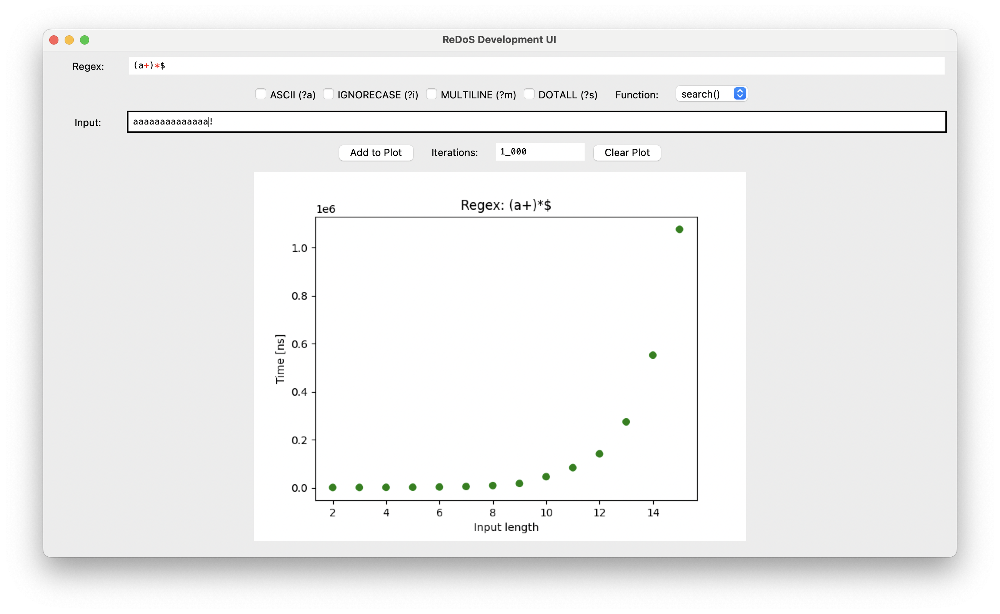

# ReDoS_dev_ui
A Python GUI application for developing [ReDoS (regular expression denial of service)](https://en.wikipedia.org/wiki/ReDoS) exploits.

**When they program hangs, you did everything right ;)**
